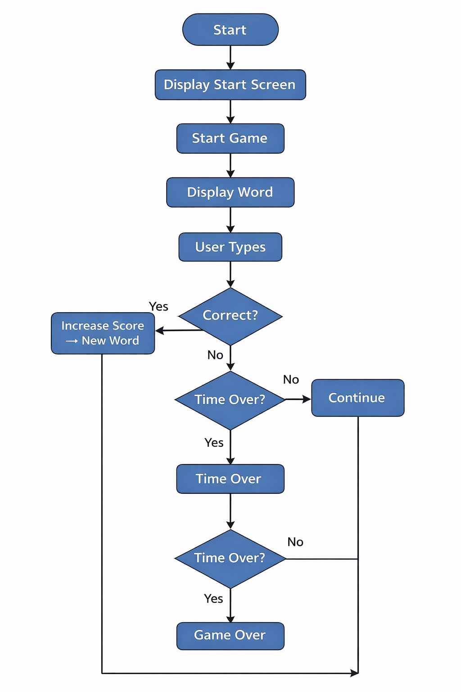

# Typing Speed Game

## Project Overview
The Typing Speed Game is a browser-based interactive game developed using HTML, CSS, and JavaScript.  
The objective of the game is to type the displayed words as quickly and accurately as possible within a limited time.

This project is created as part of the **Frontend Web Development Basics – Lab** assignment.

---

## How to Play
1. Open the game in a browser.
2. Click the **Start Game** button.
3. A word will appear on the screen.
4. Type the word correctly in the input box.
5. Each correct word increases your score.
6. The game ends when the timer reaches zero.
7. Click **Replay** to play again.

---

## Features
- Start screen with game instructions
- Random word generation
- Real-time score tracking
- Countdown timer
- Game Over screen
- Replay option
- Interactive keyboard input

---

## Technologies Used
- HTML  
- CSS  
- JavaScript  
- DOM Manipulation  
- Event Handling  

---

## Screenshots

### Start Screen

### Gameplay

### Game Over

### Typing Action

---

## Flowchart

---

## GitHub Repository
https://github.com/har1Nee/Typing-Speed-Game
